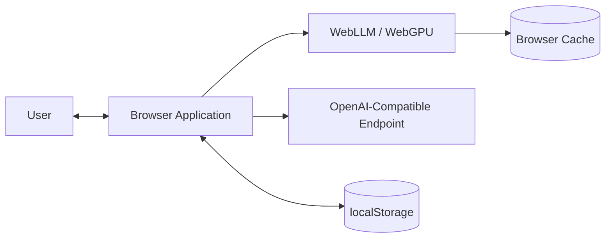
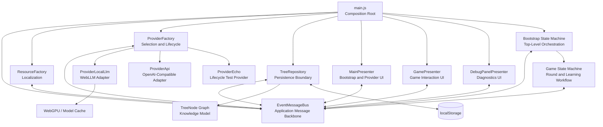
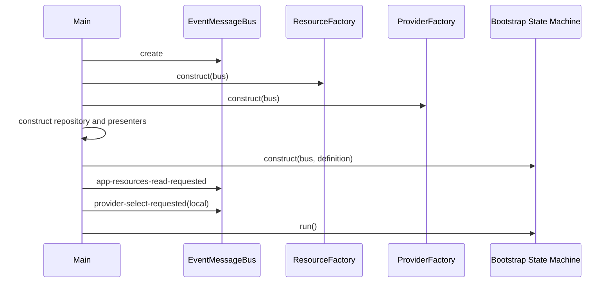
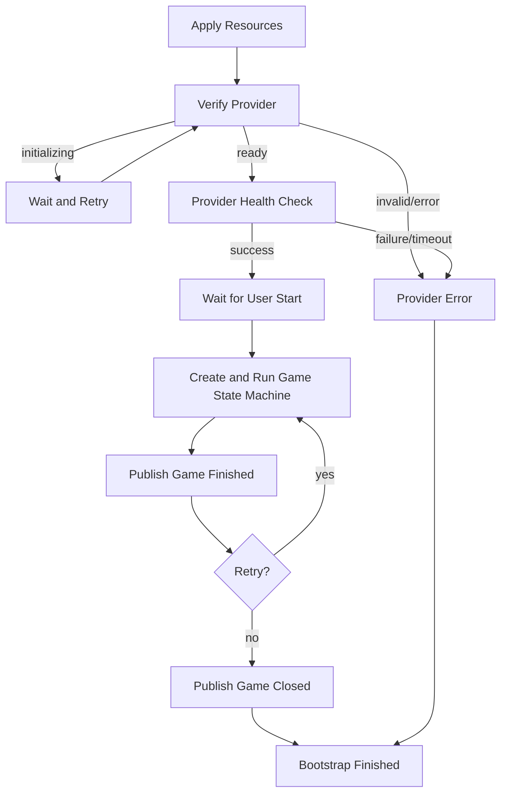
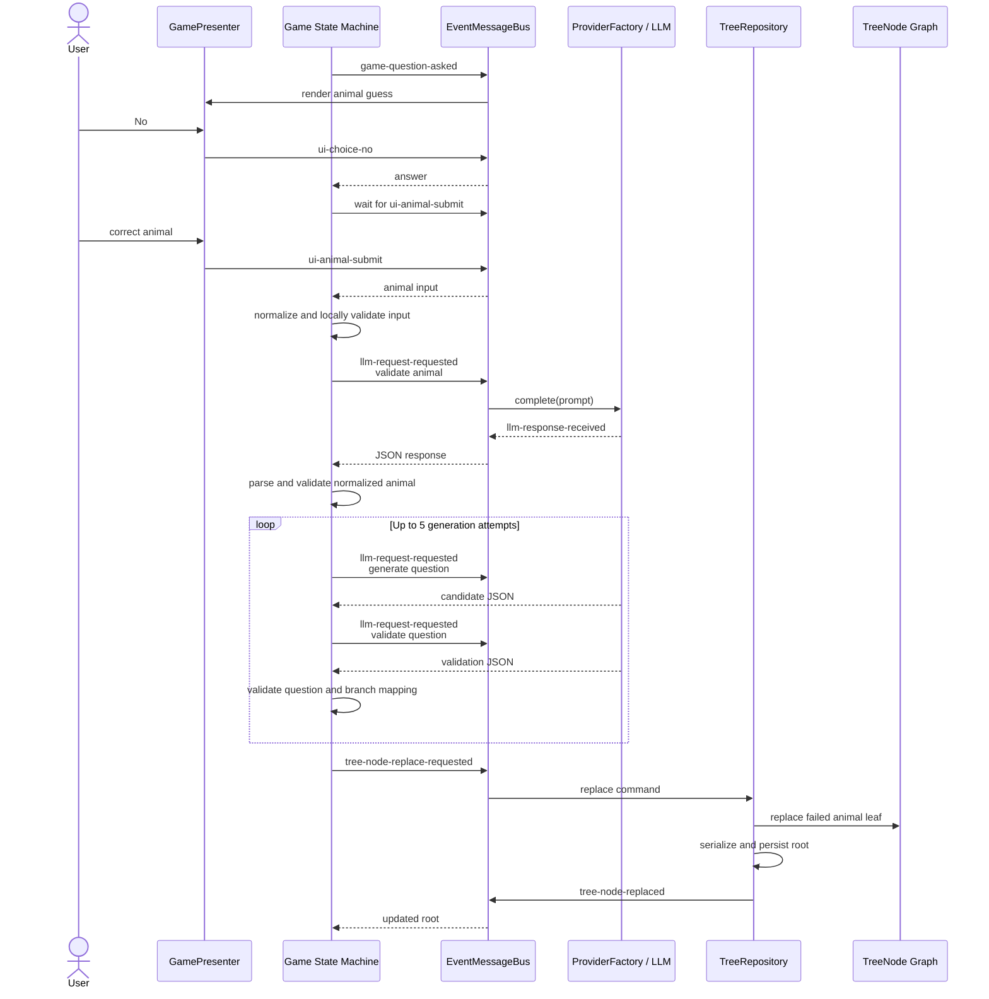

# Architecture

## Local LLM Browser

This document describes the implemented architecture of the Local LLM Browser project: a self-learning animal guessing game and a compact architecture lab for integrating probabilistic LLM calls into a deterministic browser application.

The application runs in a single browser page. It is not a distributed system, but it deliberately explores several patterns commonly found in larger event-driven systems: explicit message contracts, request/reply semantics, timeouts, lifecycle events, workflow orchestration, provider boundaries, persistence boundaries, and stale asynchronous result protection.

## Architectural Thesis

The central design rule is:

> The deterministic application owns control flow, state, validation, retries, and persistence. The LLM performs only bounded language tasks and its output is treated as untrusted external input.

The model does not decide which screen is displayed, which state executes next, how the decision tree is traversed, whether a response is accepted, or when data is saved.

This separation makes the application easier to reason about, test, and extend even when model output is malformed, semantically wrong, delayed, or unavailable.

## Goals

The architecture is designed to demonstrate:

- local LLM inference through WebLLM and WebGPU;
- bounded LLM responsibilities with JSON response contracts;
- deterministic orchestration around probabilistic model calls;
- event-driven communication between independent runtime components;
- request/reply messaging with explicit timeouts;
- declarative bootstrap and game state machines;
- nested workflow orchestration;
- pluggable inference providers;
- stale asynchronous initialization protection;
- persistent, user-corrected structured knowledge;
- testable presentation, provider, orchestration, and persistence boundaries;
- explicit trade-offs rather than accidental complexity.

## Non-Goals

The project does not currently attempt to provide:

- a production-scale distributed architecture;
- a general-purpose agent framework;
- autonomous LLM control over application behavior;
- conventional vector-search or document-chunk RAG;
- model training or fine-tuning;
- a production authentication or secrets-management solution;
- complete cross-browser compatibility;
- a framework-based frontend or build pipeline;
- a fully configured public OpenAI-compatible provider workflow.

## System Context



The default execution path uses WebLLM to run an MLC-compiled instruction-tuned model in the browser. Model artifacts are downloaded on the first run and may then be reused from the browser cache.

The application itself has no dedicated backend in the default path.

## High-Level Runtime Architecture



The event bus is the runtime communication backbone. Most long-lived components do not call one another directly after construction. They publish commands or updates and subscribe to the event types they own.

The state machines own workflow progression. Presenters own browser interaction. Providers own inference transport. The repository owns persistence. The tree model owns graph behavior.

## Runtime Components

| Component | Primary responsibility | Owns | Does not own |
|---|---|---|---|
| [`main.js`](./main.js) | Construct the runtime and start orchestration | Object creation and initial startup events | Game rules, provider behavior, persistence |
| [`EventMessageBus`](./event-message-bus.js) | Dispatch events and provide request/reply primitives | Subscriptions, one-time waits, timeout cleanup, runtime IDs | Business workflow or response validation |
| [`ResourceFactory`](./resource-factory.js) | Resolve and publish localized resources | Current resource bundle | UI rendering or workflow |
| [`ProviderFactory`](./provider-factory.js) | Select, initialize, monitor, and route requests to an LLM provider | Active provider lifecycle and provider status | Game state or prompt acceptance rules |
| [`ProviderLocalLlm`](./provider-local-llm.js) | Adapt WebLLM to the provider contract | WebGPU checks, model initialization, local completion calls | Application retries or persistence |
| [`ProviderApi`](./provider-api.js) | Adapt an OpenAI-compatible endpoint | HTTP request format and response extraction | Secrets management or public configuration UI |
| [`ProviderEcho`](./provider-echo.js) | Provide a lightweight provider lifecycle implementation | Deterministic echo completion | Full structured game emulation |
| [`StateMachine`](./state-machine.js) | Execute declarative workflow definitions | Current node, shared context, transition execution | Domain-specific state definitions |
| [`Bootstrap State Machine`](./state-machine-bootstrap.js) | Orchestrate application readiness and game sessions | Bootstrap lifecycle and nested game execution | Decision-tree traversal details |
| [`Game State Machine`](./state-machine-game.js) | Orchestrate one game and learning cycle | Round context, retries, LLM validation flow | Storage implementation or UI rendering |
| [`TreeRepository`](./repository-tree.js) | Load, save, and replace nodes in the knowledge tree | Cached root and serialized persistence | Game navigation decisions |
| [`TreeNode`](./model-tree-node.js) | Represent and manipulate the decision graph | Tree topology, traversal, replacement, serialization | Storage access or UI |
| [`MainPresenter`](./presenter-main.js) | Render application/provider state and publish top-level user intent | Main-screen DOM state | Provider lifecycle decisions |
| [`GamePresenter`](./presenter-game.js) | Render game interaction and publish user answers | Game-screen DOM state | Game workflow decisions |
| [`DebugPanelPresenter`](./presenter-debug-panel.js) | Render prompt/response diagnostics | Debug-panel DOM state | Orchestration; the complete observer flow is still unfinished |

## Composition Root

[`main.js`](./main.js) is the explicit composition root.

It performs four operations:

1. Creates the shared `EventMessageBus`.
2. Constructs every long-lived runtime component with its required dependencies.
3. Publishes the initial resource and provider-selection commands.
4. Starts the bootstrap state machine.



Construction is centralized so that dependency wiring remains visible in one file. The project intentionally avoids a dependency-injection container because the runtime graph is still small enough to read directly.

## State Ownership

The architecture assigns one clear owner to each important kind of state.

| State | Owner |
|---|---|
| Registered subscriptions and one-time waits | `EventMessageBus` |
| Selected provider and provider initialization status | `ProviderFactory` |
| WebLLM engine instance | `ProviderLocalLlm` |
| Current bootstrap node and bootstrap context | Bootstrap `StateMachine` |
| Current game node, failed guess, retry count, and generated question | Game `StateMachine` |
| Current in-memory decision-tree root | `TreeRepository` |
| Decision-tree structure and node behavior | `TreeNode` |
| Main-screen DOM state | `MainPresenter` |
| Game-screen DOM state | `GamePresenter` |
| Localized static resources | `ResourceFactory` |

An important invariant is that LLM responses never become application state merely because the model returned them. They are parsed and validated by deterministic workflow code first.

## Event-Driven Messaging

### Event Contract

All public event names are defined in [`event-ids.js`](./event-ids.js). The bus rejects unknown published or subscribed event IDs.

Events are grouped conceptually into:

- commands, such as `provider-status-requested`;
- updates, such as `provider-status-changed`;
- user intent, such as `ui-choice-yes`;
- workflow observations, such as `state-machine-transitioned`.

The event envelope is intentionally small:

```js
{
  id,
  message
}
```

### Subscription Types

The bus supports:

- persistent subscriptions through `subscribe`;
- one-time subscriptions through `subscribeOne`;
- subscriptions to the special internal `all` channel;
- request/reply composition through `publishAndReceive`;
- timeout cleanup for one-time subscriptions;
- explicit unsubscribe callbacks;
- full disposal of timers and subscription registries.

A timeout value of `0` represents an indefinite user wait. This is used for interactions such as waiting for a Yes/No answer.

### Request/Reply

State-machine nodes frequently use:

```js
await machine.publishAndReceive(
  commandEvent,
  responseEvent,
  sourceId,
  payload,
  timeoutMs,
);
```

The method subscribes to the expected response before publishing the command, preventing a synchronous response from being missed.

It can also wait for one of several response events, for example either:

- `llm-response-received`; or
- `llm-request-failed`.

### Current Correlation Model

The current message envelope does not include a request or correlation ID. One-time subscribers are matched by response event type, not by message-level correlation.

This is safe for the current sequential workflows, which do not intentionally issue overlapping requests of the same response family. It would not be sufficient for arbitrary concurrent commands.

A production evolution would add:

- `requestId`;
- `correlationId`;
- explicit command and response metadata;
- cancellation;
- per-request tracing.

## Workflow Orchestration

The project uses a small generic state-machine engine rather than embedding workflow progression in UI callbacks.

A definition contains:

- a machine ID;
- a start node;
- optional error and end nodes;
- shared context;
- declarative node definitions;
- transition mappings.

Each node provider returns a transition key. `StateMachineNode` resolves that key to the next node.

Unexpected programming errors are not silently converted into business outcomes. Only `EventMessageBusTimeoutError` is automatically mapped to the machine's error transition. Other errors escape to the caller and eventually reach the top-level bootstrap error handler.

### Nested State Machines

The bootstrap state machine creates and runs a separate game state machine for each round.



This creates a hierarchical workflow without coupling the generic state-machine engine to game-specific rules.

## Game and Learning Workflow

The game state machine traverses a persistent Yes/No decision tree.

A question node selects its `yesNode` or `noNode`. An animal node represents a guess.

When a guess fails, the application performs a bounded learning workflow:



### Deterministic Responsibilities

The game state machine owns:

- input normalization;
- local format validation;
- prompt construction;
- request timeouts;
- JSON parsing;
- required-field checks;
- validation of the normalized animal;
- validation that Yes and No map to different animals;
- validation that the returned animal set matches the expected pair;
- retry count;
- the final persistence command.

### LLM Responsibilities

The LLM is asked to:

- decide whether a submitted term is a valid common animal name;
- normalize the animal name;
- propose a factual Yes/No question;
- propose a branch mapping;
- validate and normalize the generated question.

The LLM never directly edits the tree.

## LLM Trust Boundary

LLM output is treated like input from an external service.

The application applies several defensive steps:

1. Local validation runs before the first model call.
2. Model output must parse as a JSON object.
3. Required values must be present.
4. Normalized animal names must pass local validation again.
5. A separately prompted validation step checks the generated question.
6. Deterministic code verifies the exact expected pair of animals.
7. Identical Yes and No branches are rejected.
8. Invalid candidates are retried up to a fixed maximum.
9. Only an accepted result is sent to the repository.

This is contract-based integration, but it currently uses manual validation rather than a formal JSON Schema library.

The architecture assumes that model validation reduces risk; it does not make model output inherently trustworthy.

## Provider Architecture

### Provider Contract

[`ProviderBase`](./provider-base.js) defines the minimal provider interface:

```js
isReady()
initialize({ onProgress })
complete(prompt)
```

The active provider is selected by `ProviderFactory`, while orchestration uses provider-independent bus events.

This produces two related patterns:

- a Strategy-like boundary: different completion implementations can be selected;
- an Adapter boundary: WebLLM and OpenAI-compatible HTTP APIs are normalized to the same interface.

### Provider Lifecycle

`ProviderFactory` waits until it has both:

- localized resources; and
- a requested provider type.

It then creates and initializes the effective provider configuration.

The factory publishes:

- selection;
- initialization progress;
- readiness;
- failure;
- completion responses;
- request failures.

### Stale Initialization Protection

Provider initialization is asynchronous. Resources or provider selection may change before an older initialization completes.

`ProviderFactory` protects the active state with:

- `configRevision`;
- `activeInitializationRevision`;
- `lastActivatedConfigKey`;
- provider instance identity.

Progress or completion from an outdated initialization is ignored unless every guard still matches the current effective configuration.

This prevents a slow, stale provider initialization from overwriting a newer selection.

### Provider-Specific Notes

#### Local WebLLM Provider

`ProviderLocalLlm`:

- checks for WebGPU;
- rejects `file://` execution;
- verifies required remote model and WASM resources;
- creates a WebLLM engine;
- reports initialization progress;
- submits a single user prompt and returns the first response content.

#### OpenAI-Compatible Provider

`ProviderApi`:

- validates base URL, API key, and model configuration;
- calls `/chat/completions`;
- extracts OpenAI-compatible response content.

The adapter exists, but neutral public configuration and secure credential handling are not yet exposed. Putting a reusable private API key directly into browser code would not be an acceptable production design.

#### Echo Provider

`ProviderEcho` exercises provider initialization and transport behavior by returning the prompt unchanged.

It is useful for component tests, but it is not a deterministic end-to-end game fixture because the game expects task-specific JSON responses.

## Knowledge Model and Persistence

The application knowledge base is a graph-shaped Yes/No decision tree.

### Node Types

A `TreeNode` is either:

- a question node with `question`, `yesNode`, and `noNode`; or
- an animal node with `name`.

### Runtime Identity

Tree nodes receive runtime IDs from `EventMessageBus.GetNextId()`.

The serialized graph stores node records and edge IDs. During restoration, the stored IDs are used to reconstruct topology, while restored `TreeNode` instances receive new runtime IDs.

Therefore, node IDs are runtime identity, not stable public identifiers.

### Persistence Format

The repository serializes the graph in a normalized structure:

```js
{
  start: 1,
  nodes: {
    "1": {
      id: 1,
      yesNodeId: 2,
      noNodeId: 3,
      question: "Does it live in water?",
      name: ""
    }
  }
}
```

The actual graph may contain many records.

### Repository Boundary

`TreeRepository` is the only component that directly accesses the storage adapter.

It supports:

- loading the root;
- saving a complete root;
- replacing a target animal node with a new question node;
- persisting the updated graph;
- publishing the resulting root.

The default storage adapter is `localStorage`, but tests can inject another object implementing `getItem` and `setItem`.

### Recovery Behavior

If stored data is missing, malformed, or cannot be restored, the repository falls back to a default tree containing `cat`.

This favors application availability over surfacing corrupted local data to the user. A production version might preserve the invalid payload for diagnostics and offer explicit recovery controls.

## Presentation Boundary

Presenters inherit common DOM and subscription behavior from [`PresenterBase`](./presenter-base.js).

`PresenterBase` provides:

- root-element validation;
- scoped DOM lookup;
- bus subscription helpers;
- DOM event listener registration;
- cleanup callbacks;
- event publication;
- idempotent initialization.

Presenters translate between:

- domain/application events; and
- browser DOM state or user intent.

The design is presentation-separated and resembles parts of MVP, but it is not presented as a strict implementation of a named UI framework pattern.

Business workflow remains in the state machines rather than in click handlers.

## Design Patterns and Principles

Pattern names below describe observable structures in the code. They are not claims that the project implements every canonical variation of those patterns.

| Pattern or principle | Implementation | Why it is used | Trade-off |
|---|---|---|---|
| Composition Root | `main.js` | Makes construction and dependency wiring explicit | Manual wiring grows with the runtime |
| Publish–Subscribe / Observer | `EventMessageBus` | Decouples long-lived components | Event flow is less obvious than direct calls |
| Request–Reply over Messaging | `publishAndReceive` | Models asynchronous commands with responses and timeouts | Current implementation lacks correlation IDs |
| State Machine | `StateMachine` and `StateMachineNode` | Makes workflow, retries, and terminal paths explicit | More structure than a small game strictly needs |
| Hierarchical / Nested Workflow | Bootstrap machine launches game machine | Separates session lifecycle from one game round | Context transfer must remain disciplined |
| Strategy-like Provider Boundary | Provider implementations behind one contract | Allows inference mechanisms to be replaced | Configuration and capability differences still need handling |
| Adapter | WebLLM and OpenAI-compatible providers | Normalizes external inference APIs | Lowest-common-denominator interface is intentionally small |
| Factory and Lifecycle Coordinator | `ProviderFactory` | Centralizes selection, initialization, status, and routing | The class has several responsibilities and may later be split |
| Repository | `TreeRepository` | Isolates persistence from workflow and domain model | Event-based CRUD is more indirect than method calls |
| Storage Adapter / Dependency Inversion | Injectable `storage` | Enables testing and future storage replacement | The adapter contract is implicit rather than typed |
| Presentation Separation | Presenter classes | Keeps DOM logic out of state machines | Requires more events and mapping code |
| Contract-Based Integration | JSON prompts plus deterministic validation | Constrains probabilistic output | Manual validation can drift from prompts |
| Explicit State Ownership | Ownership table and component boundaries | Reduces hidden shared mutable state | Requires discipline as features grow |
| Fail-Fast Programming Errors | Unexpected errors propagate | Prevents programming defects from being mistaken for business outcomes | A top-level error can terminate the current run |
| Graceful Data Recovery | Invalid persisted tree falls back to default | Keeps the demo usable | Corruption is currently hidden from the user |
| Stale Result Guard | Provider configuration revisions | Prevents async race conditions | Adds lifecycle bookkeeping |

## Dependency Rules

The intended dependency direction is:

```text
Browser DOM
    ↕
Presenters
    ↕ events
State Machines / Application Workflow
    ↕ events
Providers and Repository Boundaries
    ↕
External Runtime APIs
```

Key rules:

1. `main.js` constructs dependencies but does not implement business workflow.
2. Presenters do not select the next application state.
3. State machines do not directly manipulate the DOM.
4. State machines do not directly access `localStorage`.
5. The tree model does not publish application events.
6. Providers do not edit application state or the knowledge tree.
7. LLM responses are validated before persistence.
8. External API details remain behind provider adapters.
9. Event IDs are centralized rather than spread as arbitrary strings.
10. Long-lived browser listeners and bus subscriptions should be disposable.

## Failure Handling

The architecture distinguishes expected operational failure from unexpected programming failure.

### Expected Operational Failure

Examples:

- provider still initializing;
- WebGPU unavailable;
- model resource unavailable;
- LLM request failure;
- LLM timeout;
- malformed JSON;
- semantically invalid model response;
- exhausted question-generation retries;
- invalid local user input;
- invalid persisted tree.

These failures become:

- status events;
- explicit workflow transitions;
- retry loops;
- fallback data;
- user-visible error or lifecycle screens.

### Unexpected Programming Failure

Examples:

- missing required dependency;
- unknown event ID;
- duplicate subscription source ID;
- unknown state-machine node;
- invalid repository command payload.

These generally throw errors rather than being converted into a successful or expected game result.

## Observability

The current implementation already exposes several observable events:

- provider initialization progress;
- provider state changes;
- LLM responses and failures;
- state-machine transitions;
- game lifecycle events;
- debug context updates.

`DebugPanelPresenter` can display prompt and response snapshots, but the independent complete event-stream observer is not finished.

A fuller diagnostics design could add:

- correlation IDs;
- structured timestamps;
- durations;
- token counts;
- cold- versus warm-start measurements;
- provider and model metadata;
- persisted trace export;
- redaction of sensitive prompts.

## Testing Strategy

Tests run directly in the browser through [`tests.html`](./tests.html), ES modules, and a lightweight custom test harness.

The suite covers the main architectural boundaries:

- event subscriptions and cleanup;
- one-time waits and timeouts;
- request/reply behavior;
- resource selection;
- provider lifecycle and stale initialization;
- WebLLM provider integration seams;
- tree traversal, serialization, restoration, and replacement;
- presenter rendering and UI event publication;
- generic state-machine transitions;
- bootstrap workflow;
- game and learning workflow.

Important test seams include:

- injectable storage;
- injectable WebLLM module;
- declarative state-machine definition factories;
- configurable retry delays in workflow context;
- event-based component boundaries;
- provider implementations behind a small interface.

The browser-native approach keeps the repository simple, although a larger project would likely add automated headless browser execution in CI.

## Intentional Overengineering

For the size of the game, direct method calls and a few event handlers would be simpler.

The extra structure is intentional because the project is also an architecture lab. It makes the following topics concrete and discussable:

- state ownership;
- event semantics;
- orchestration;
- retry and timeout behavior;
- provider replacement;
- lifecycle races;
- test boundaries;
- deterministic control around probabilistic AI.

The relevant engineering skill is not merely adding abstractions. It is being able to explain:

- which abstractions solve a real scaling or reliability problem;
- which abstractions exist mainly for exploration;
- which parts would be removed from a minimal product;
- which parts would become more valuable as workflows, providers, or UI surfaces grow.

## Known Architectural Limitations

- All components run in one browser page and one application runtime.
- Request/reply events do not currently carry correlation IDs.
- The current design assumes sequential requests for each response-event family.
- There is no application-level cancellation or `AbortController` propagation for active inference requests.
- The OpenAI-compatible provider is not publicly configurable.
- API credentials cannot be safely protected in a purely static browser application.
- JSON contracts are validated manually rather than through a shared schema definition.
- `ProviderFactory` combines provider creation, lifecycle coordination, status publication, and request routing.
- The application does not yet expose a complete top-level disposal lifecycle.
- The debug panel's complete event-observer workflow is unfinished.
- The application does not explicitly move its own orchestration or inference boundary into a dedicated Web Worker.
- `localStorage` is sufficient for the demo but offers limited capacity, querying, versioning, and transactional behavior.
- Corrupted stored data is silently replaced with the default tree.
- Full fresh-clone and cross-browser end-to-end verification is still in progress.

## Possible Production Evolution

A larger production version could add:

1. Typed event envelopes with request and correlation IDs.
2. Cancellation and timeout propagation through `AbortController`.
3. Shared JSON Schema or runtime schema validation.
4. A deterministic scripted provider for complete end-to-end tests.
5. Headless browser tests and CI.
6. Secure server-side proxying for remote providers and secrets.
7. Provider capability metadata and runtime configuration.
8. IndexedDB or a backend repository with schema migration.
9. Structured tracing and performance metrics.
10. Web Worker isolation for expensive inference-related work.
11. Explicit application startup, shutdown, and disposal.
12. Versioned persistence and user-visible recovery tools.
13. Streaming response support where it provides real UX value.
14. Separate provider registry, lifecycle manager, and request router if their responsibilities continue to grow.

## Architectural Invariants

The following invariants should remain true as the project evolves:

- The LLM does not own application navigation.
- The decision tree remains the source of truth for game knowledge.
- Only validated data is persisted.
- UI code does not contain workflow transitions.
- Persistence implementation remains behind a boundary.
- Provider-specific details do not leak into game orchestration.
- Event names remain centralized.
- Async provider results cannot activate stale configuration.
- Operational failures have explicit outcomes.
- The project is described as distributed-system-inspired, not as an actual distributed system.
- Structured decision-tree retrieval is not misrepresented as conventional vector RAG.

## Related Documents

- [README](./README.md) — project purpose, features, setup, and public overview.
- [Bootstrap State Machine](./state-machine-bootstrap.md) — detailed bootstrap workflow notes.
- [Game State Machine](./state-machine-game.md) — detailed game workflow notes.
- [Main Presenter](./presenter-main.md) — main-screen presentation contract.
- [Game Presenter](./presenter-game.md) — game-screen presentation contract.

## Provenance

This is an independent clean-room portfolio project created from scratch. It contains no proprietary production code, employer data, confidential APIs, or client assets.
