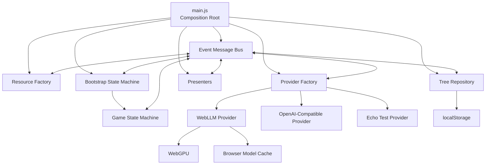

# Local LLM Browser

### Self-Learning Animal Guessing Game & Event-Driven Architecture Lab

A browser-only portfolio project that explores how probabilistic LLM calls can be embedded inside a deterministic, testable application.

The application plays a Yes/No animal-guessing game over a persistent decision tree. When it fails to guess the animal, an instruction-tuned LLM validates the user's correction, proposes a new distinguishing question, and validates the resulting branch mapping. The application—not the model—owns the workflow, state, persistence, retries, and error handling.

The default provider runs **Llama 3.2 3B Instruct directly in the browser** through WebLLM and WebGPU. The default path requires no dedicated application backend, no API key, and no build step.

> **Project status:** active development. The core runtime, learning workflow, local LLM integration, and automated component tests are implemented. Additional end-to-end verification, diagnostics, and public demo materials are in progress.

## Why This Project Exists

This project is intentionally more than a chat wrapper.

The game is a compact domain that makes several engineering concerns visible:

* separating deterministic application logic from probabilistic model output;
* using bounded LLM tasks with explicit JSON contracts;
* orchestrating asynchronous workflows through declarative state machines;
* modeling request/reply messaging, timeouts, and lifecycle events;
* switching inference implementations behind a provider boundary;
* storing user-corrected knowledge outside the model weights;
* testing browser application components without a bundler or test framework.

For a game of this size, some abstractions are deliberately more elaborate than a minimal implementation would require. The repository is both a working prototype and an architecture lab: the goal is to make state ownership, messaging semantics, failure paths, and trade-offs easy to inspect and discuss.

## How the Game Learns

1. The bootstrap state machine loads resources, initializes the selected LLM provider, and performs a health check.
2. The game state machine loads the persisted decision tree and traverses it using the user's Yes/No answers.
3. When the application reaches an animal leaf, it makes a guess.
4. If the guess is wrong, the user enters the correct animal.
5. The input first passes deterministic format checks and then an LLM validation step with a JSON-only response contract.
6. The LLM generates a short Yes/No question that distinguishes the old animal from the new one.
7. A second LLM call validates the question and its Yes/No branch mapping. Invalid or malformed candidates are retried up to a fixed limit.
8. The failed animal leaf is replaced with a question node containing two animal branches.
9. The updated graph is serialized to `localStorage` and is used in later rounds.

The model is **not trained or fine-tuned**. “Learning” in this project means that user feedback expands the application's external, persistent knowledge tree.

## Bounded LLM Responsibilities

The LLM is used only for small, constrained tasks:

| Task                | LLM responsibility                                                  | Deterministic application responsibility                                 |
| ------------------- | ------------------------------------------------------------------- | ------------------------------------------------------------------------ |
| Animal correction   | Validate and normalize one common English animal name               | Local format checks, JSON parsing, rejection of malformed output         |
| Question generation | Propose one factual Yes/No question and branch mapping              | Retry limits, state transitions, persistence, lifecycle handling         |
| Question validation | Verify that the question distinguishes exactly the expected animals | Validate returned fields, animal set, empty values, and invalid mappings |
| Provider startup    | Return a basic health-check response                                | Provider lifecycle, readiness polling, timeout and error handling        |

The LLM never decides which application screen to display, which state to enter, how the tree is traversed, or when knowledge is persisted.

## Structured Retrieval-Augmented Workflow

This project does not use conventional vector-search or document-chunk RAG.

Instead, it uses a **structured retrieval-augmented workflow over a persistent decision tree**:

1. The application retrieves the current question or animal node from external knowledge stored outside the model.
2. The relevant animal context is inserted into bounded prompts.
3. The model validates or generates a candidate result.
4. Deterministic code validates the response.
5. User feedback updates the external tree used by future rounds.

The retrieval mechanism is deterministic tree traversal rather than similarity search. The LLM provider is a generation component inside the larger application pipeline, not the owner of the knowledge base.

## Architecture



### Main Components

* **Composition root** — `main.js` creates the long-lived runtime objects, selects the default provider, and starts orchestration.
* **Event message bus** — regular and one-time subscriptions, request/reply-style `publishAndReceive`, explicit timeouts, known event IDs, and cleanup.
* **State-machine engine** — declarative nodes, transition maps, shared context, error/end nodes, event waits, and nested workflows.
* **Bootstrap state machine** — resources → provider readiness → health check → user start → game launch → retry or close.
* **Game state machine** — tree traversal → guess → user correction → LLM validation → question generation → validation → persistence.
* **Provider factory** — provider lifecycle, status events, and revision guards that prevent stale asynchronous initialization from becoming active.
* **Tree repository** — serialization, restoration, fallback behavior, node replacement, and a storage adapter boundary over `localStorage`.
* **Presenters** — event-driven separation of bootstrap/status UI, game UI, and the unfinished debug-panel boundary.
* **Resource factory** — English and German UI resource modules. Animal normalization and prompt contracts are currently English-only.

This is not a distributed system: every component runs inside one browser page. It intentionally models selected event-driven and distributed-system messaging patterns within a single runtime.

## LLM Providers

| Provider | Purpose                                        | Current status                                                                                           |
| -------- | ---------------------------------------------- | -------------------------------------------------------------------------------------------------------- |
| `local`  | In-browser inference through WebLLM and WebGPU | Default runtime path                                                                                     |
| `openai` | OpenAI-compatible `/chat/completions` endpoint | Adapter implemented; public endpoint/model/auth configuration is not exposed yet                         |
| `echo`   | Provider lifecycle and transport testing       | Component-test provider; it does not emulate the structured responses required by the complete game flow |

The current local configuration uses:

```text
Llama-3.2-3B-Instruct-q4f16_1-MLC
```

Model configuration is defined near the top of `provider-factory.js`. A replacement model must have compatible MLC model artifacts and a matching WebGPU model library.

## Running Locally

### Requirements

* a recent browser with WebGPU support;
* enough local memory and browser storage for the selected model;
* network access during the first model download;
* a local HTTP server—opening `index.html` through `file://` is not supported.

### Start the Application

```bash
git clone https://github.com/rkorin/local-llm-browser.git
cd local-llm-browser
python -m http.server 8080
```

Open:

```text
http://localhost:8080
```

The first start downloads the model artifacts from remote sources. WebLLM stores model data in the browser cache, so later starts may reuse the cached files.

There is no npm install, bundling, or application backend in the default path.

## Running the Tests

Start the same local HTTP server and open:

```text
http://localhost:8080/tests.html
```

The repository currently contains **103 browser-native tests across 13 suites**, covering:

* event-bus subscriptions, request/reply, timeouts, and cleanup;
* resource loading and localization behavior;
* tree serialization, restoration, replacement, and fallback behavior;
* presenter rendering and event publication;
* the generic state-machine engine;
* bootstrap and game state-machine transitions;
* local, echo, and factory provider behavior.

The test runner uses ES modules and browser APIs directly, without npm or an external test framework.

## Project Structure

```text
main.js                         runtime composition root
event-ids.js                    canonical event contract
event-message-bus.js            messaging and timeout semantics
state-machine.js                generic state-machine engine
state-machine-bootstrap.js      application bootstrap workflow
state-machine-game.js           game and learning workflow
provider-factory.js             provider selection and lifecycle
provider-local-llm.js           WebLLM/WebGPU inference
provider-api.js                 OpenAI-compatible HTTP adapter
provider-echo.js                simple test provider
repository-tree.js              persistence boundary
model-tree-node.js              decision-tree graph model
presenter-*.js                  UI boundaries
resources*.js                   localized resources and prompts
tests.html / *.tests.js         browser-native test suite
```

## Design Choices and Trade-Offs

### Plain JavaScript and ES Modules

The project intentionally avoids a frontend framework and build pipeline. This keeps module boundaries, runtime composition, browser APIs, and asynchronous control flow directly visible. A production UI with broader requirements might benefit from TypeScript, a bundler, and a framework.

### Event-Driven Communication

An event bus reduces direct coupling and makes request/reply behavior, timeouts, and transitions observable. In a small game, direct method calls would be simpler. The additional structure is intentional because messaging semantics are one of the subjects explored by the project.

### State Machines Instead of Implicit UI Flow

Bootstrap and gameplay are represented as explicit workflows. This makes retries, terminal states, user waits, and model failure paths testable without hiding control flow inside event handlers.

### Persistent Tree Instead of Model Memory

The decision tree is the source of truth. The model does not “remember” previous games and does not own navigation. This makes learned behavior inspectable, serializable, and reproducible.

### Local Inference

Running the model in the browser improves privacy and removes per-request API dependency, but startup time, memory usage, and inference speed depend heavily on the user's browser and GPU. The first launch still requires network access to download model artifacts.

## Current Limitations

* WebGPU support and performance vary by browser, operating system, and GPU.
* The first launch is not offline because model and runtime artifacts must be downloaded.
* Animal input and prompt contracts currently expect common English animal names.
* The OpenAI-compatible provider still needs neutral external configuration and a public selection mechanism.
* The debug presenter exists, but the independent all-events observer and public debug workflow are not finished.
* The project does not currently claim full cross-browser support, production deployment, streaming generation, model training, or fine-tuning.
* Final fresh-clone browser smoke testing and public demo materials are still in progress.

## Next Steps

* verify the complete fresh-clone WebLLM game loop in supported browsers;
* record and publish the browser test results;
* add a deterministic end-to-end provider or fixture for the full learning workflow;
* expose safe OpenAI-compatible provider configuration;
* complete the event-observer/debug workflow;
* add a screenshot or short demo GIF.

## Project Provenance

This is an independent portfolio project created from scratch to explore recurring software-engineering and applied-AI patterns. It contains no proprietary production code, employer data, confidential APIs, or client assets.
