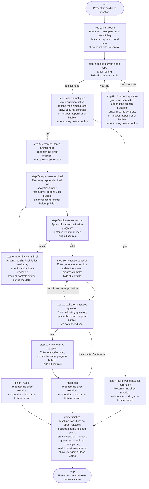

# Game Presenter

`GamePresenter` owns the visible game conversation and game controls. It does not orchestrate the round and does not read state-machine context directly. It reacts only to public events and selected `game-state-machine` transitions.

Behavioral contract source of truth: this document.
Implementation: [`presenter-game.js`](./presenter-game.js).

## Game flow and presenter reactions

This diagram repeats the transition topology from [`state-machine-game.md`](./state-machine-game.md). Every node also states the direct `GamePresenter` reaction.



Any infrastructure timeout or unknown transition that reaches `finish-invalid` follows the same presenter route: the game machine itself does not render an error. After the nested machine returns, the bootstrap machine publishes `game-finished`, and the Presenter renders the localized `invalid` result.

## Presenter boundary

`GamePresenter` is intentionally narrow:

- it does not inspect state-machine context;
- it does not derive gameplay from tree data, validation payloads, or LLM responses;
- it reacts only to the agreed public signals from the game machine and bootstrap lifecycle.

For gameplay rendering, the Presenter relies on:

- automatic `state-machine-transitioned` events from `game-state-machine` for steps 1, 2, 7, 8, 9, 10, 11, and 12;
- `game-question-asked` for visible yes/no questions at steps 3 and 6;
- `game-finished` and `game-closed` from bootstrap for result lifecycle.

No other game presentation events exist.

## Presenter screens

| Screen | Entered by | Visible UI |
|---|---|---|
| `hidden` | Initial state before a round starts | Game panel hidden |
| `start` | `state-machine-transitioned(step-1-start-round)` | Intro message; no controls |
| `routing` | First Yes/No click or `state-machine-transitioned(step-2-decide-current-node-type)` | Chat preserved; all answer controls hidden |
| `choice` | `game-question-asked` | Chat plus Yes / No controls |
| `input` | `state-machine-transitioned(step-7-request-user-animal)` | Chat plus animal input while the machine waits for `ui-animal-submit` |
| `validating-animal` | First animal submit or `state-machine-transitioned(step-8-validate-user-animal)` | Validation-progress message; no controls |
| `invalid-animal-feedback` | `state-machine-transitioned(step-9-report-invalid-animal)` | Invalid-animal feedback during the retry delay; no controls |
| `generating-question` | `state-machine-transitioned(step-10-generate-question)` | Shared progress bubble shows question generation; no controls |
| `validating-question` | `state-machine-transitioned(step-11-validate-generated-question)` | Same progress bubble shows validation; no controls |
| `saving-learning` | `state-machine-transitioned(step-12-save-learned-question)` | Same progress bubble shows persistence; no controls |
| `restart` | Public `game-finished` with a non-`invalid` result | Localized result plus Try Again / Close Game |
| `error` | Public `game-finished` with `invalid` | Preserved chat plus localized error and Try Again / Close Game |
| `lifecycle-pending` | First Try Again or Close Game action from `restart` or `error` | Result remains visible; lifecycle controls hidden |
| `closed` | Public `game-closed` | Static closed message; no controls |

### Screen notes

- `start` clears chat and appends exactly one intro message.
- `routing` is entered immediately after the first Yes/No click, before the Presenter publishes the selected answer.
- `choice` appends one game question bubble and exposes the Yes/No controls.
- `input` appends the missed-animal request only on the first step 7 entry in a round, then exposes a fresh input only while the state machine is waiting.
- `validating-animal` is entered immediately after the first animal submit; the submitted animal already appears as a user bubble before controls hide.
- `invalid-animal-feedback` removes transient validation progress, appends localized feedback, and waits for the next step 7 transition to expose a fresh input.
- `generating-question`, `validating-question`, and `saving-learning` reuse one shared progress bubble instead of appending chat spam.
- `restart` appends a non-error result without clearing prior round chat.
- `error` removes transient progress and appends a localized error without clearing prior round chat.
- `lifecycle-pending` starts immediately after Try Again or Close Game and keeps lifecycle controls hidden until the next round or close event.
- `closed` appends a static closed message without clearing prior round chat.

## Per-round animal-request rule

The Presenter owns one small piece of presentation state:

```js
hasRequestedUserAnimal
```

Its behavior is deliberately local to the Presenter:

- construction initializes it to `false`;
- step 1 resets it to `false` for the new round;
- the first entry into step 7 appends the animal request and sets it to `true`;
- later entries into step 7 clear, expose, and focus the fresh input only after the machine starts waiting;
- step 8 appends validation progress and hides all controls;
- step 9 appends the playful invalid-animal message while all controls remain hidden;
- state-machine context does not need a UI-specific flag.

This prevents the step 9 to step 7 retry loop from repeating the original animal request.

## Event reactions

### `state-machine-transitioned`

Only transitions for `machineId: "game-state-machine"` are considered.

| Current node | Reaction |
|---|---|
| `step-1-start-round` | Reset round presentation state, clear chat, append intro, enter `start` |
| `step-2-decide-current-node-type` | Enter `routing` and hide answer controls |
| `step-7-request-user-animal` | Append the request once per round, enter `input` |
| `step-8-validate-user-animal` | Append validation progress, enter `validating-animal`, hide controls |
| `step-9-report-invalid-animal` | Append validation feedback, enter `invalid-animal-feedback`, keep controls hidden |
| `step-10-generate-question` | Update shared progress bubble, enter `generating-question` |
| `step-11-validate-generated-question` | Update the same bubble, enter `validating-question` |
| `step-12-save-learned-question` | Update the same bubble, enter `saving-learning` |
| Every other game node | Ignore the transition and preserve the current screen |

### Domain and lifecycle events

| Event | Reaction |
|---|---|
| `app-static-resources-changed` | Store resources and update localized labels |
| `state-machine-transitioned` for `machineId: "game-state-machine"` | Drive explicit presenter screens for steps 1, 2, 7, 8, 9, 10, 11, and 12 |
| `game-question-asked` | Append one question and enter `choice` |
| `game-finished` | Remove transient progress; append a result in `restart` or an error in `error`; preserve chat |
| `game-closed` | Remove transient progress, append the closed message, enter `closed`; preserve chat |

Only transitions for `machineId: "game-state-machine"` are accepted. Other `state-machine-transitioned` events are ignored.

## User intent emitted by the Presenter

| UI action | Published event |
|---|---|
| Click Yes while in `choice` | Append a localized user bubble, enter `routing`, then publish `ui-choice-yes` |
| Click No while in `choice` | Append a localized user bubble, enter `routing`, then publish `ui-choice-no` |
| First Submit or Enter while in `input` | Append the trimmed animal as a user bubble, clear the field, enter `validating-animal`, then publish `ui-animal-submit` with the captured value |
| First Try Again while in `restart` or `error` | Enter `lifecycle-pending`, then publish `ui-game-retry-requested` |
| First Close Game while in `restart` or `error` | Enter `lifecycle-pending`, then publish `ui-game-close-requested` |

These UI intents are accepted only on their owning screen. The Presenter always leaves that screen before publishing, so duplicate clicks and duplicate submits are ignored until the next valid screen transition.

## Message ownership

All user-facing copy comes from the active resources.

- Step 1 uses `game.messages.roundStarted`.
- Step 7 uses `game.messages.lostAskAnimal`.
- Step 8 uses `game.messages.validatingAnimalInput`.
- Step 9 uses `game.messages.invalidAnimalInput`.
- Step 10 uses `game.messages.generatingQuestion`.
- Step 11 uses `game.messages.validatingQuestion`.
- Step 12 uses `game.messages.savingLearning`.
- `game-finished` uses `game.finished[result]`.
- `game-closed` uses `game.finished.closed`.

The result text is written from the application's perspective:

- `won`: the application guessed the animal;
- `lost`: the application did not guess the animal;
- `invalid`: the round ended in an invalid technical state.

Learning success or failure is intentionally not presented as a separate outcome.
The user sees only the game result; generation, validation, and persistence remain internal implementation details.
Progress copy for steps 10 through 12 is deliberately neutral and does not mention learning.

## Presenter invariants

- The Presenter never reads or mutates game state-machine context.
- Internal orchestration steps do not create chat messages unless an explicit presentation event or supported transition requires one.
- A question event appends exactly one bubble.
- The first Yes/No action immediately leaves `choice`; later clicks are ignored until another question event.
- Every action is accepted only on its owning screen and leaves that screen before publishing, so duplicate clicks are ignored.
- The initial animal request appears at most once per round.
- Step 8 and step 9 never expose answer controls.
- Steps 10 through 12 never expose answer or lifecycle controls.
- Steps 10 and 11 retries update one stable progress bubble instead of appending chat messages.
- Every invalid-animal transition adds one feedback bubble; the following step 7 provides the fresh input.
- Animal input is visible only while step 7 is waiting for `ui-animal-submit`.
- Starting a new round clears old chat and resets all per-round presentation state.
- Finishing or closing a game appends to the existing conversation instead of clearing it.
- Invalid results use the dedicated `error` screen with retry/close actions.
- Finishing or closing a game removes active answer controls.

