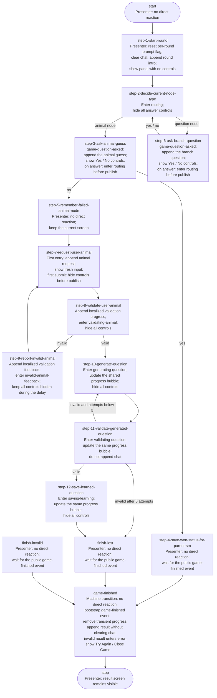

# Game Presenter

`GamePresenter` owns the visible game conversation and game controls. It does not orchestrate the round and does not read state-machine context directly. It reacts only to public events and selected `game-state-machine` transitions.

Implementation source of truth: [`presenter-game.js`](./presenter-game.js).

## Game flow and presenter reactions

This diagram repeats the transition topology from [`state-machine-game.md`](./state-machine-game.md). Every node also states the direct `GamePresenter` reaction.



Any infrastructure timeout or unknown transition that reaches `finish-invalid` follows the same presenter route: the game machine itself does not render an error. After the nested machine returns, the bootstrap machine publishes `game-finished`, and the Presenter renders the localized `invalid` result.

## Presenter screens

| Screen | Entered by | Visible UI |
|---|---|---|
| `hidden` | Initial state or legacy hidden mode | Game panel hidden |
| `start` | `state-machine-transitioned(step-1-start-round)` | Intro message; no controls |
| `routing` | First Yes/No click or step 2 | Chat preserved; all answer controls hidden |
| `choice` | `game-question-asked` | Chat plus Yes / No controls |
| `input` | Step 7 or a compatibility mode event | Chat plus animal input while the machine waits for `ui-animal-submit` |
| `validating-animal` | Step 8 | Validation-progress message; no controls |
| `invalid-animal-feedback` | Step 9 | Invalid-animal feedback during the retry delay; no controls |
| `generating-question` | Step 10 | Shared progress bubble shows question generation; no controls |
| `validating-question` | Step 11 | Same progress bubble shows validation; no controls |
| `saving-learning` | Step 12 | Same progress bubble shows persistence; no controls |
| `restart` | Public `game-finished` | Localized result plus Try Again / Close Game |
| `error` | Public `game-finished` with `invalid` | Preserved chat plus localized error and Try Again / Close Game |
| `lifecycle-pending` | First Try Again or Close Game action from result/error | Result remains visible; lifecycle controls hidden |
| `closed` | Public `game-closed` | Static closed message; no controls |

## Per-round animal-request rule

The Presenter owns one small piece of presentation state:

```js
hasRequestedUserAnimal
```

Its behavior is deliberately local to the Presenter:

- construction initializes it to `false`;
- step 1 resets it to `false` for the new round;
- the first entry into step 7 appends the animal request and sets it to `true`;
- later entries into step 7 clear, expose, and focus the fresh input only after the machine starts waiting;
- step 8 appends validation progress and hides all controls;
- step 9 appends the playful invalid-animal message while all controls remain hidden;
- state-machine context does not need a UI-specific flag.

This prevents the step 9 to step 7 retry loop from repeating the original animal request.

## Event reactions

### `state-machine-transitioned`

Only transitions for `machineId: "game-state-machine"` are considered.

| Current node | Reaction |
|---|---|
| `step-1-start-round` | Reset round presentation state, clear chat, append intro, enter `start` |
| `step-2-decide-current-node-type` | Enter `routing` and hide answer controls |
| `step-7-request-user-animal` | Append the request once per round, enter `input` |
| `step-8-validate-user-animal` | Append validation progress, enter `validating-animal`, hide controls |
| `step-9-report-invalid-animal` | Append validation feedback, enter `invalid-animal-feedback`, keep controls hidden |
| `step-10-generate-question` | Update shared progress bubble, enter `generating-question` |
| `step-11-validate-generated-question` | Update the same bubble, enter `validating-question` |
| `step-12-save-learned-question` | Update the same bubble, enter `saving-learning` |
| Every other game node | Ignore the transition and preserve the current screen |

### Domain and lifecycle events

| Event | Reaction |
|---|---|
| `app-static-resources-changed` | Store resources and update localized labels |
| `game-question-asked` | Append one question and enter `choice` |
| `game-chat-cleared` | Clear chat |
| `game-chat-message-added` | Append one chat bubble |
| `game-finished` | Remove transient progress; append a result in `restart` or an error in `error`; preserve chat |
| `game-closed` | Remove transient progress, append the closed message, enter `closed`; preserve chat |

`game-interaction-state-changed` and `game-context-changed` remain compatibility inputs for the older full-context presentation flow.

## User intent emitted by the Presenter

| UI action | Published event |
|---|---|
| Click Yes while in `choice` | Enter `routing`, then publish `ui-choice-yes` |
| Click No while in `choice` | Enter `routing`, then publish `ui-choice-no` |
| First Submit or Enter while in `input` | Enter `validating-animal`, then publish `ui-animal-submit` with the captured value |
| First Try Again while in `restart` or `error` | Enter `lifecycle-pending`, then publish `ui-game-retry-requested` |
| First Close Game while in `restart` or `error` | Enter `lifecycle-pending`, then publish `ui-game-close-requested` |

## Message ownership

All user-facing copy comes from the active resources.

- Step 1 uses `game.messages.roundStarted`.
- Step 7 uses `game.messages.lostAskAnimal`.
- Step 8 uses `game.messages.validatingAnimalInput`.
- Step 9 uses `game.messages.invalidAnimalInput`.
- Step 10 uses `game.messages.generatingQuestion`.
- Step 11 uses `game.messages.validatingQuestion`.
- Step 12 uses `game.messages.savingLearning`.
- `game-finished` uses `game.finished[result]`.
- `game-closed` uses `game.finished.closed`.

The result text is written from the application's perspective:

- `won`: the application guessed the animal;
- `lost`: the application did not guess the animal;
- `invalid`: the round ended in an invalid technical state.

Learning success or failure is intentionally not presented as a separate outcome.
The user sees only the game result; generation, validation, and persistence remain internal implementation details.
Progress copy for steps 10 through 12 is deliberately neutral and does not mention learning.

## Presenter invariants

- The Presenter never reads or mutates game state-machine context.
- Internal orchestration steps do not create chat messages unless an explicit presentation event or supported transition requires one.
- A question event appends exactly one bubble.
- The first Yes/No action immediately leaves `choice`; later clicks are ignored until another question event.
- Every action is accepted only on its owning screen and leaves that screen before publishing, so duplicate clicks are ignored.
- The initial animal request appears at most once per round.
- Step 8 and step 9 never expose answer controls.
- Steps 10 through 12 never expose answer or lifecycle controls.
- Steps 10 and 11 retries update one stable progress bubble instead of appending chat messages.
- Every invalid-animal transition adds one feedback bubble; the following step 7 provides the fresh input.
- Animal input is visible only while step 7 is waiting for `ui-animal-submit`.
- Starting a new round clears old chat and resets all per-round presentation state.
- Finishing or closing a game appends to the existing conversation instead of clearing it.
- Invalid results use the dedicated 
`
error
`
 screen with retry/close actions.
- Finishing or closing a game removes active answer controls.

