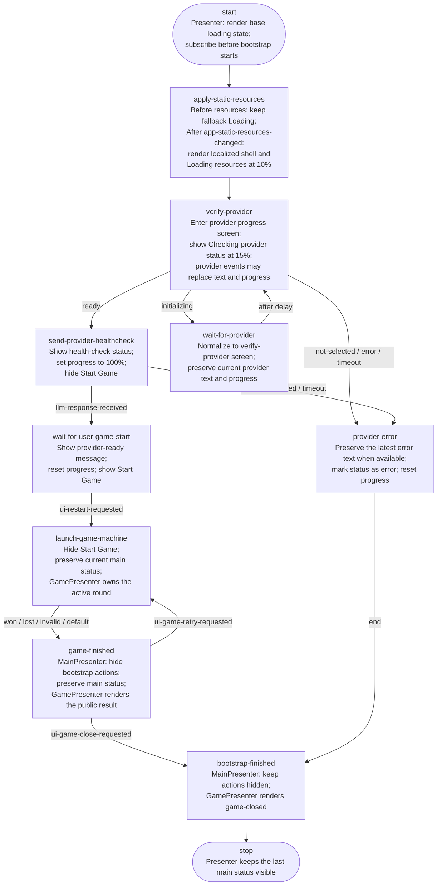

# Main Presenter

`MainPresenter` owns the application shell, localization controls, bootstrap status text, provider progress, and the initial Start Game action. It does not orchestrate bootstrap or game execution. It reacts to bootstrap transitions and infrastructure events published through the shared event bus.

Implementation source of truth: [`presenter-main.js`](./presenter-main.js).

## Bootstrap flow and presenter reactions

This diagram repeats the transition topology from [`state-machine-bootstrap.md`](./state-machine-bootstrap.md). Every node also states the direct `MainPresenter` reaction.

The transition event is published before a bootstrap node executes. Event-specific updates can therefore refine the screen after its initial transition rendering.

## Presenter screens

| Screen | Entered by | Visible UI |
|---|---|---|
| `base` | Presenter construction | Generic loading state before resources or bootstrap transitions |
| `apply-static-resources` | Bootstrap transition | Localized resource-loading status after resources arrive |
| `verify-provider` | `verify-provider` or normalized `wait-for-provider` | Provider status, selection, and initialization progress |
| `send-provider-healthcheck` | Bootstrap transition | Health-check status at complete bootstrap progress |
| `wait-for-user-game-start` | Bootstrap transition | Provider-ready text and Start Game button |
| `provider-error` | Bootstrap transition | Fatal provider/bootstrap error |
| Other bootstrap nodes | Bootstrap transition | Start Game hidden; previous main status preserved |

`wait-for-provider` is deliberately normalized to the `verify-provider` visual screen. The machine can alternate between polling and delay nodes without resetting useful provider text or progress.

## Transition reactions

Only `state-machine-transitioned` events for `machineId: "bootstrap-state-machine"` are considered.

| Current node | MainPresenter reaction |
|---|---|
| `apply-static-resources` | Enter resource-loading screen |
| `verify-provider` | Enter provider progress screen |
| `wait-for-provider` | Normalize to provider progress screen; do not rerender when already active |
| `send-provider-healthcheck` | Show health-check text and 100% progress |
| `wait-for-user-game-start` | Show ready text and Start Game |
| `provider-error` | Show latest error text and error styling |
| `launch-game-machine` | Hide Start Game; leave game rendering to `GamePresenter` |
| `game-finished` | Keep bootstrap actions hidden; public result belongs to `GamePresenter` |
| `bootstrap-finished` | Keep actions hidden and preserve the last main status |
| Any unknown bootstrap node | Hide Start Game and preserve the last main status |

A transition from `verify-provider` to `wait-for-provider`, or back again, does not cause a visual reset because both machine nodes normalize to the same presenter screen.

## Infrastructure event reactions

### Resources and general status

| Event | Reaction |
|---|---|
| `app-static-resources-changed` | Store resources, update document language/title and localized labels, then rerender the current screen |
| `app-status-changed` | Render the supplied status text, error flag, and normalized progress |

### Provider lifecycle

| Event | Applied when | Reaction |
|---|---|---|
| `provider-selected` | Provider progress screen | Show localized provider-loading text at 8% |
| `provider-initialize-progress` | Provider progress screen | Show supplied progress text and normalized percentage |
| `provider-initialize-completed` | Health-check screen | Show localized Model loaded text at 100% |
| `provider-initialize-failed` | Any screen | Show provider error and reset progress |
| `provider-status-changed: initializing` | Provider progress screen | Restore the provider verification screen |
| `provider-status-changed: ready` | Start-game screen | Preserve the ready-to-start screen |
| `provider-status-changed: error` | Any screen | Show provider error and reset progress |

Provider selection and progress events are screen-aware. They cannot overwrite unrelated UI after bootstrap has advanced to the start-game screen.

### LLM health check

| Event | Applied when | Reaction |
|---|---|---|
| `llm-response-received` | Health-check screen | Show localized Model loaded text at 100% |
| `llm-request-failed` | Any screen | Show LLM error and reset progress |

## User intent emitted by the Presenter

| UI action | Published event |
|---|---|
| Change language | `app-resources-read-requested` with `en` or `de` |
| Click Start Game | `ui-restart-requested` |
| Click the hidden debug entry point | `ui-debug-toggle-requested` |

The debug entry point remains wired for the future independent debug observer, but the button is intentionally hidden in HTML.

## Progress rules

`normalizeProgress` accepts both fractional and percentage-style values:

- values from `0` through `1` are converted to `0%` through `100%`;
- larger numeric values are treated as percentages;
- all values are rounded and clamped to `0%` through `100%`;
- missing, non-numeric, or `NaN` values become `0%`.

Screen-owned baseline progress:

| Screen | Baseline |
|---|---:|
| `base` | 0% |
| `apply-static-resources` | 10% |
| `verify-provider` | 15% |
| `send-provider-healthcheck` | 100% |
| `wait-for-user-game-start` | 0% |
| `provider-error` | 0% |

Provider progress events can replace the `verify-provider` baseline while that visual screen is active.

## Ownership boundary with GamePresenter

`MainPresenter` owns bootstrap readiness, not the game conversation.

- It publishes the first start request.
- It hides Start Game when bootstrap launches the nested game machine.
- It does not render game questions, animal input, round results, retry, or close controls.
- `GamePresenter` owns the active round and reacts to the public `game-finished` and `game-closed` events.
- Returning from a completed game does not restart provider bootstrap.

## Presenter invariants

- The Presenter never calls `ResourceFactory`, `ProviderFactory`, or a state machine directly.
- Bootstrap transitions from other machine IDs are ignored.
- Provider progress cannot overwrite an unrelated presenter screen.
- `verify-provider` and `wait-for-provider` share one stable visual screen.
- Start Game is visible only on `wait-for-user-game-start`.
- Every screen render hides bootstrap actions before selectively enabling valid actions.
- Resources can arrive before or after a transition; the current screen is rerendered once resources are available.
- Game lifecycle presentation remains outside `MainPresenter`.
