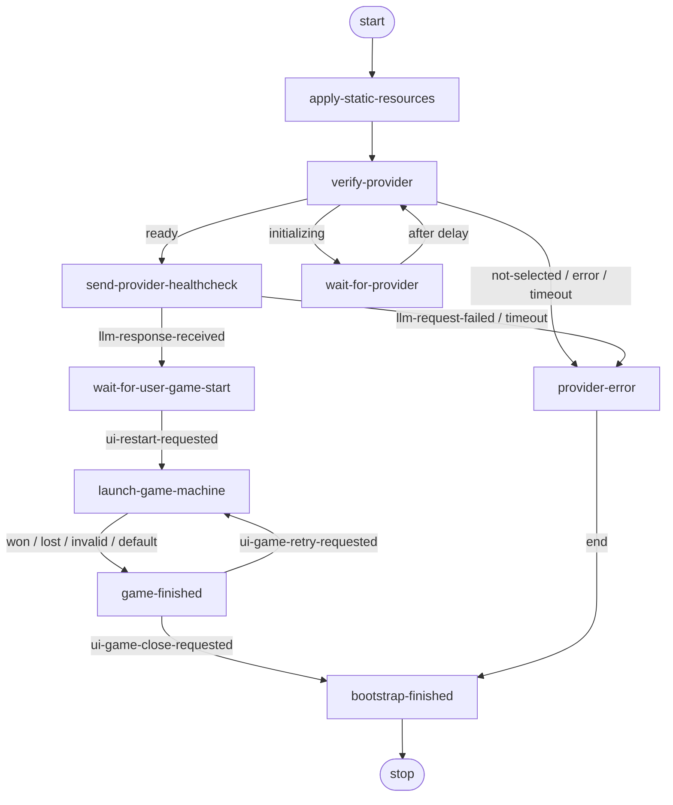

# Bootstrap State Machine

`bootstrap-state-machine` is the top-level application orchestrator. It loads localized resources, waits for the selected LLM provider to become ready, verifies the provider with a health-check request, launches game rounds, and handles the user's decision after each round.

Implementation source of truth: [`state-machine-bootstrap.js`](./state-machine-bootstrap.js).

## Transition overview

## General rules

- Start node: `apply-static-resources`.
- Shared error node: `provider-error`.
- End node: `bootstrap-finished`.
- Before entering every node, the base `StateMachine` publishes `state-machine-transitioned` with `machineId`, `previousNodeId`, and `currentNodeId`.
- The bootstrap machine has no permanent event-bus subscription. Each step creates only the one-time wait required by its current operation.
- Timeout `0` means that the wait does not expire automatically.
- An `EventMessageBusTimeoutError` raised inside a node is routed automatically to the shared `provider-error` node.
- An unknown transition result also falls back to `provider-error` when no explicit transition exists.
- Unexpected non-timeout exceptions are not converted into `provider-error`; they reject `StateMachine.run()`.

## Machine context

Required when the machine is created:

- `eventBus` — the shared application event bus.

Fields written by the bootstrap machine:

- `resources` — the active localized resource bundle;
- `providerStatus` — the most recently reported provider status;
- `providerStatusDetails` — the complete provider-status event payload;
- `providerHealthcheckEvent` — the health-check result payload;
- `bootstrapProviderVerified` — indicates that the health check succeeded;
- `gameStateMachine` — the current nested game machine;
- `lastGameResult` — the result of the most recent game round;
- `machineResult` — the final bootstrap result: `error` or `closed`.

Optional input fields:

- `resourceLanguage` — the language passed to the resource-loading request;
- `providerRetryDelayMs` — overrides the default 5,000 ms provider-status retry delay;
- `buildGameStateMachineDefinition` — a test or alternative game state-machine definition factory.

## Step 1 — `apply-static-resources`

### Purpose

Obtain the active localization bundle before provider verification and game orchestration begin.

### Publishes

- `app-resources-read-requested`
  - payload: `context.resourceLanguage`;
  - handled by: `ResourceFactory`.

### Waits for

- `app-static-resources-changed`
  - payload: the loaded resources object;
  - timeout: 10,000 ms.

### Context changes

- stores the response payload in `context.resources`.

### Transitions

- successful response → `verify-provider`;
- timeout → `provider-error`.

## Step 2 — `verify-provider`

### Purpose

Read the current provider state through the event contract instead of calling `ProviderFactory` directly.

### Publishes

- `provider-status-requested`
  - payload: `null`;
  - handled by: `ProviderFactory`.

### Waits for

- `provider-status-changed`
  - the payload is expected to contain at least `status`;
  - timeout: 10,000 ms.

### Context changes

- stores `event.message.status` in `context.providerStatus`, or `error` when the status is missing;
- stores the complete event payload in `context.providerStatusDetails`.

### Transitions

- `ready` → `send-provider-healthcheck`;
- `initializing` → `wait-for-provider`;
- `not-selected`, any other status, or timeout → `provider-error`.

## Step 3 — `wait-for-provider`

### Purpose

Avoid continuously polling a provider while it is initializing. The step pauses before checking the provider status again.

### Publishes

No events.

### Waits for

- a local timer;
- default delay: 5,000 ms;
- `context.providerRetryDelayMs` can override the delay.

### Transitions

- after the delay → `verify-provider`.

## Step 4 — `send-provider-healthcheck`

### Purpose

Verify that a provider reporting `ready` can actually process an LLM request.

### Publishes

- `llm-request-requested`
  - payload: `context.resources.prompts.healthcheck`;
  - handled by: `ProviderFactory`.

### Waits for

The first of:

- `llm-response-received` — the provider completed the request;
- `llm-request-failed` — the provider could not complete the request;
- timeout: 60,000 ms.

### Context changes

- stores the result payload in `context.providerHealthcheckEvent`;
- sets `context.bootstrapProviderVerified = true` after `llm-response-received`.

### Transitions

- `llm-response-received` → `wait-for-user-game-start`;
- `llm-request-failed` or timeout → `provider-error`.

## Step 5 — `wait-for-user-game-start`

### Purpose

Pause bootstrap orchestration until the user explicitly requests the first game.

### Publishes

No events.

### Waits for

- `ui-restart-requested`;
- timeout: `0`, so the wait does not expire automatically.

### Transitions

- `ui-restart-requested` → `launch-game-machine`.

## Step 6 — `launch-game-machine`

### Purpose

Create and execute a separate state machine for one game round without mixing game orchestration into the bootstrap flow.

### Publishes

The bootstrap step itself publishes no event. The nested game state machine uses the same `eventBus` and publishes its own game events.

### Waits for

- completion of `gameStateMachine.run()`.

### Actions and lifecycle

1. Selects `context.buildGameStateMachineDefinition` or the standard `getGameStateMachineDefinition`.
2. Creates a new `StateMachine`.
3. Passes `context.resources` to the nested machine.
4. Stores the instance in `context.gameStateMachine`.
5. Runs the game round.
6. Stores the result in `context.lastGameResult`.
7. Always calls `gameStateMachine.dispose()` in `finally`.

### Transitions

- `won`, `lost`, `invalid`, or any other returned status → `game-finished`.

## Step 7 — `game-finished`

### Purpose

Notify the presentation layer about the round result and wait for the user to retry or close the game.

### Publishes immediately

- `game-finished`
  - payload: `{ result: context.lastGameResult || "invalid" }`;
  - observed by presenters and other permanent runtime observers.

### Waits for

The first of:

- `ui-game-retry-requested`;
- `ui-game-close-requested`;
- timeout: `0`, so the wait does not expire automatically.

### Transitions

- `ui-game-retry-requested` → `launch-game-machine` for a new round;
- `ui-game-close-requested` → publishes `game-closed`, sets `context.machineResult = "closed"`, and enters `bootstrap-finished`.

### Additionally publishes on close

- `game-closed`
  - payload: the same payload previously published with `game-finished`.

## Step 8 — `provider-error`

### Purpose

Provide one shared error node for an unavailable provider, a failed health check, and infrastructure wait timeouts.

### Publishes

No events directly.

### Waits for

Nothing.

### Context changes

- sets `context.machineResult = "error"`.

### Transitions

- returns `end`, which the base machine resolves to `bootstrap-finished`.

## Step 9 — `bootstrap-finished`

### Purpose

Provide one terminal node for the bootstrap state machine.

### Publishes

No events.

### Waits for

Nothing.

### Transitions

- returns `done`;
- `done → null`, which stops machine execution.

## Event contract summary

| Direction | Event | Step |
|---|---|---|
| Publishes | `app-resources-read-requested` | `apply-static-resources` |
| Waits for | `app-static-resources-changed` | `apply-static-resources` |
| Publishes | `provider-status-requested` | `verify-provider` |
| Waits for | `provider-status-changed` | `verify-provider` |
| Publishes | `llm-request-requested` | `send-provider-healthcheck` |
| Waits for | `llm-response-received` | `send-provider-healthcheck` |
| Waits for | `llm-request-failed` | `send-provider-healthcheck` |
| Waits for | `ui-restart-requested` | `wait-for-user-game-start` |
| Publishes | `game-finished` | `game-finished` |
| Waits for | `ui-game-retry-requested` | `game-finished` |
| Waits for | `ui-game-close-requested` | `game-finished` |
| Publishes | `game-closed` | `game-finished`, on close only |
| Publishes automatically | `state-machine-transitioned` | before every node |

## Timeout policy

| Wait | Timeout |
|---|---:|
| Resource loading | 10,000 ms |
| Provider-status request | 10,000 ms |
| Provider health check | 60,000 ms |
| User starts the game | 0 — no automatic timeout |
| User selects retry or close | 0 — no automatic timeout |
| Retry while provider is initializing | 5,000 ms delay; this is a timer, not an event timeout |