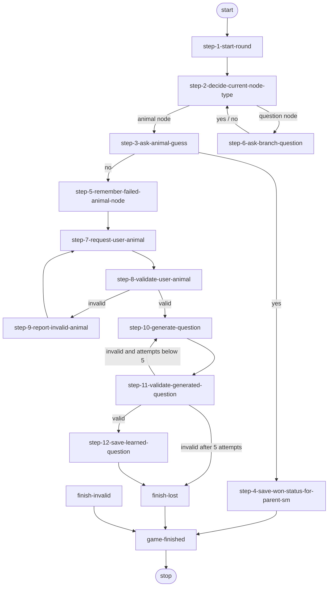

# Game State Machine

`game-state-machine` orchestrates one animal-guessing round. It reads the current decision tree, traverses question nodes from user answers, attempts an animal guess, validates a new animal after a failed guess, asks the LLM to generate and validate a distinguishing question, and persists the learned branch.

Behavioral contract source of truth: this document.
Implementation: [`state-machine-game.js`](./state-machine-game.js).

## Transition overview

Any infrastructure timeout or unknown transition that reaches the shared error route enters `finish-invalid`.

## General rules

- Start node: `step-1-start-round`.
- Shared error node: `finish-invalid`.
- End node: `game-finished`.
- One game machine represents one round and is disposed by the bootstrap machine after `run()` completes.
- The machine has no permanent event-bus subscription. Each step creates only the one-time waits needed by its current operation.
- Before entering every node, the base `StateMachine` publishes `state-machine-transitioned` with `machineId`, `previousNodeId`, and `currentNodeId`.
- User waits use timeout `0`, so they do not expire automatically.
- Repository and LLM operations use finite timeouts.
- An `EventMessageBusTimeoutError` raised by a node is routed automatically to `finish-invalid`.
- Unexpected non-timeout exceptions are not converted into `finish-invalid`; they reject `StateMachine.run()`.

The game machine does not publish `game-finished`. Its terminal node only returns the round result to the bootstrap machine. The bootstrap machine publishes the public `game-finished` event afterward.

## Presenter-facing contract

`GamePresenter` should treat this machine as a producer of exactly two presentation-facing signals:

- automatic `state-machine-transitioned` events before every node entry;
- explicit `game-question-asked` events only when the machine is ready to show a yes/no question to the user.

The intended split is strict:

- this machine owns tree traversal, validation, generation, persistence, and waiting;
- the Presenter owns screen selection, chat bubbles, control visibility, and local optimistic UI transitions;
- this machine does not publish chat-clear, chat-append, input-mode, or generic presentation-state events.

Bootstrap completes the public game lifecycle around this machine:

- after the nested machine returns, bootstrap publishes `game-finished`;
- after the user chooses to close from the result screen, bootstrap publishes `game-closed`.

For the current Presenter contract, the important step-to-UI mapping is:

| State-machine signal | Presenter expectation |
|---|---|
| `state-machine-transitioned(step-1-start-round)` | clear chat, append the round intro, hide all controls |
| `state-machine-transitioned(step-2-decide-current-node-type)` | enter routing and hide answer controls |
| `game-question-asked` from step 3 or 6 | append one game question and show Yes / No controls |
| `state-machine-transitioned(step-7-request-user-animal)` | append the missed-animal prompt once per round, then show the input |
| `state-machine-transitioned(step-8-validate-user-animal)` | show validation progress and keep controls hidden |
| `state-machine-transitioned(step-9-report-invalid-animal)` | replace validation progress with invalid-animal feedback |
| `state-machine-transitioned(step-10-generate-question)` | show generation progress on the shared progress bubble |
| `state-machine-transitioned(step-11-validate-generated-question)` | update the shared progress bubble for validation |
| `state-machine-transitioned(step-12-save-learned-question)` | update the shared progress bubble for saving |

## Required context

- `eventBus` — the shared application event bus.
- `resources` — the active localized resources and prompt builders.

Optional input:

- `invalidAnimalDelayMs` — overrides the default 2,000 ms delay before asking for another animal after invalid input.

## Runtime context fields

Tree traversal:

- `rootNode` — the current decision-tree root;
- `currentNode` — the node currently being evaluated;
- `failedAnimalNodeId` — runtime ID of the animal node that failed to match;
- `failedAnimalName` — name stored in that failed animal node.

User animal validation:

- `userAnimalInput` — raw value submitted by the user;
- `userAnimalName` — normalized animal name accepted by validation;
- `userAnimalValidationError` — the current animal-validation reason code.

Question generation and validation:

- `questionGenerationAttemptCount` — number of generation attempts in this round;
- `generatedQuestionHistory` — previously generated question strings sent back to the generator to discourage duplicates;
- `generatedQuestion` — current candidate or validated question;
- `generatedQuestionYesAnimal` — animal assigned to the candidate's yes branch;
- `generatedQuestionNoAnimal` — animal assigned to the candidate's no branch;
- `generatedQuestionValidationError` — current question-validation reason code.

Round result:

- `gameResultForParentSm` — result exposed to the parent bootstrap machine;
- `machineResult` — final state-machine result: `won`, `lost`, or `invalid`.

## Step 1 — `step-1-start-round`

### Purpose

Load the latest persisted decision tree at the beginning of every round and reset all round-specific context.

### Publishes

- `tree-root-read-requested`
  - payload: `null`;
  - handled by: `TreeRepository`.

### Waits for

- `tree-root-loaded`
  - payload: the restored root `TreeNode`;
  - timeout: 5,000 ms.

### Context changes

- sets both `context.rootNode` and `context.currentNode` to the loaded root;
- clears the failed-animal fields;
- clears user input and validation fields;
- clears the generated-question fields;
- resets `questionGenerationAttemptCount` to `0`;
- resets `generatedQuestionHistory` to an empty array.

### Transitions

- successful load → `step-2-decide-current-node-type`;
- timeout → `finish-invalid`.

## Step 2 — `step-2-decide-current-node-type`

### Purpose

Choose whether the current tree node is an animal guess or a branch question.

### Publishes

No events.

### Waits for

Nothing.

### Context changes

None.

### Transitions

- `context.currentNode.isAnimalNode()` is true → `step-3-ask-animal-guess`;
- otherwise → `step-6-ask-branch-question`.

## Step 3 — `step-3-ask-animal-guess`

### Purpose

Ask whether the animal stored in the current leaf node is the animal selected by the user.

### Publishes

- `game-question-asked`
  - payload:
    - `kind: "yes-no-question"`;
    - `role: "game"`;
    - `text: resources.game.messages.animalGuessQuestion(current animal name)`.

### Waits for

The first of:

- `ui-choice-yes`;
- `ui-choice-no`;
- timeout: `0`, so the wait does not expire automatically.

### Context changes

None.

### Transitions

- `ui-choice-yes` → `step-4-save-won-status-for-parent-sm`;
- `ui-choice-no` → `step-5-remember-failed-animal-node`.

## Step 4 — `step-4-save-won-status-for-parent-sm`

### Purpose

Record that the application guessed the animal correctly.

### Publishes

No events.

### Waits for

Nothing.

### Context changes

- sets `context.gameResultForParentSm = "won"`;
- sets `context.machineResult = "won"`.

### Transitions

- returns `end`, which the base machine resolves to `game-finished`.

## Step 5 — `step-5-remember-failed-animal-node`

### Purpose

Preserve the exact animal leaf that failed so the learned question can replace that node later.

### Publishes

No events.

### Waits for

Nothing.

### Context changes

- stores `context.currentNode.id` in `context.failedAnimalNodeId`;
- stores `context.currentNode.name` in `context.failedAnimalName`.

The node ID is a runtime identity supplied by the shared event bus. It identifies the exact in-memory node that must be replaced during this round.

### Transitions

- always → `step-7-request-user-animal`.

## Step 6 — `step-6-ask-branch-question`

### Purpose

Ask the decision question stored in the current non-leaf node and follow the selected tree branch.

### Publishes

- `game-question-asked`
  - payload:
    - `kind: "yes-no-question"`;
    - `role: "game"`;
    - `text: context.currentNode.question` when it is non-empty;
    - otherwise `resources.game.messages.branchQuestionFallback`.

### Waits for

The first of:

- `ui-choice-yes`;
- `ui-choice-no`;
- timeout: `0`, so the wait does not expire automatically.

### Context changes

- after `ui-choice-yes`, sets `context.currentNode` to `currentNode.yesNode`;
- after `ui-choice-no`, sets `context.currentNode` to `currentNode.noNode`.

### Transitions

- either answer → `step-2-decide-current-node-type`.

## Step 7 — `step-7-request-user-animal`

### Purpose

Wait for the user to provide the animal that the application failed to guess.

The machine itself does not publish a prompt message here. The Presenter derives the visible prompt and input screen from the step 7 transition.

### Publishes

No events.

### Waits for

- `ui-animal-submit`;
- payload: the value entered by the user;
- timeout: `0`, so the wait does not expire automatically.

### Context changes

- stores the event payload in `context.userAnimalInput`.

### Transitions

- `ui-animal-submit` → `step-8-validate-user-animal`.

## Step 8 — `step-8-validate-user-animal`

### Purpose

Validate the submitted animal locally and then ask the LLM to normalize and verify it.

### Local validation

The submitted value is trimmed, converted to lowercase, and has repeated whitespace collapsed. A locally valid value:

- contains at least three characters;
- starts and ends with an English letter;
- contains only English letters, spaces, and hyphens.

If local validation fails, no LLM event is published.

### Publishes when local validation succeeds

- `llm-request-requested`
  - payload: the prompt built by `resources.prompts.game.validateAnimalInput(failedAnimalName, normalizedUserAnimalName)`.

### Waits for

The first of:

- `llm-response-received`;
- `llm-request-failed`;
- timeout: 60,000 ms.

### Expected response

The LLM response body must be a JSON object containing:

- `isValid` — must be `true`;
- `normalizedAnimal` — the normalized animal name;
- `reasonCode` — used when validation fails.

The returned `normalizedAnimal` must also pass local validation.

### Context changes

- clears `context.userAnimalValidationError` at the start;
- on success, stores the normalized name in `context.userAnimalName`;
- on failure, stores one of:
  - `local-validation-failed`;
  - `llm-request-failed`;
  - `model-did-not-return-json`;
  - the model-provided `reasonCode` or `invalid`;
  - `model-returned-invalid-animal-name`.

### Transitions

- valid animal → `step-10-generate-question`;
- invalid animal or failed LLM request → `step-9-report-invalid-animal`;
- timeout → `finish-invalid`.

## Step 9 — `step-9-report-invalid-animal`

### Purpose

Give the presentation layer time to render the invalid-input state before accepting another animal value.

### Publishes

No events.

### Waits for

- a local timer;
- default delay: 2,000 ms;
- `context.invalidAnimalDelayMs` can override the delay.

### Context changes

None.

### Transitions

- after the delay → `step-7-request-user-animal`.

## Step 10 — `step-10-generate-question`

### Purpose

Ask the LLM for a yes/no question that distinguishes the failed tree animal from the user's validated animal.

### Before publishing

- increments `context.questionGenerationAttemptCount`;
- clears the current candidate question and its yes/no animal mapping.

### Publishes

- `llm-request-requested`
  - payload: the prompt built by `resources.prompts.game.generateDistinguishingQuestion(...)`;
  - prompt inputs:
    - `context.failedAnimalName`;
    - `context.userAnimalName`;
    - `JSON.stringify(context.generatedQuestionHistory)`.

The history prevents the generator from returning the same question repeatedly.

### Waits for

The first of:

- `llm-response-received`;
- `llm-request-failed`;
- timeout: 60,000 ms.

### Expected response

When a response is received, its body should be a JSON object containing:

- `question`;
- `yesAnimal`;
- `noAnimal`.

### Context changes

- stores a non-empty trimmed question in `context.generatedQuestion`;
- stores normalized branch animals in `context.generatedQuestionYesAnimal` and `context.generatedQuestionNoAnimal`;
- appends every non-empty generated question to `context.generatedQuestionHistory`, even if step 11 later rejects it.

A failed request or malformed response leaves the candidate fields empty.

### Transitions

- always → `step-11-validate-generated-question`;
- timeout → `finish-invalid`.

## Step 11 — `step-11-validate-generated-question`

### Purpose

Double-check that the generated question is usable and that its yes/no branches map exactly to the failed animal and the user's animal.

### Local pre-check

The step rejects the candidate without another LLM request when any of these fields is missing:

- `generatedQuestion`;
- `generatedQuestionYesAnimal`;
- `generatedQuestionNoAnimal`.

It records `missing-generated-question-data` in that case.

### Publishes when candidate data exists

- `llm-request-requested`
  - payload: the prompt built by `resources.prompts.game.validateGeneratedQuestion(...)`;
  - prompt inputs:
    - failed animal name;
    - user animal name;
    - candidate question;
    - candidate yes-branch animal;
    - candidate no-branch animal.

### Waits for

The first of:

- `llm-response-received`;
- `llm-request-failed`;
- timeout: 60,000 ms.

### Expected response

The LLM response body must be a JSON object containing:

- `isValid` — must be `true`;
- `normalizedQuestion` — must be non-empty;
- `yesAnimal`;
- `noAnimal`;
- `reasonCode` — used when validation fails.

The step additionally verifies that:

- yes and no animals are different;
- the unordered pair of returned animals exactly matches the failed animal and the user's animal.

### Context changes

- clears `context.generatedQuestionValidationError` at the start;
- on success, replaces the candidate fields with the validator's normalized question and branch mapping;
- on failure, stores one of:
  - `missing-generated-question-data`;
  - `llm-request-failed`;
  - `model-did-not-return-json`;
  - the model-provided `reasonCode` or `invalid`;
  - `validator-returned-empty-question`;
  - `validator-returned-same-animals`;
  - `validator-returned-unexpected-animals`.

### Transitions

- valid question and mapping → `step-12-save-learned-question`;
- invalid result while `questionGenerationAttemptCount < 5` → `step-10-generate-question`;
- invalid result when `questionGenerationAttemptCount >= 5` → `finish-lost`;
- timeout → `finish-invalid`.

## Step 12 — `step-12-save-learned-question`

### Purpose

Replace the failed animal node with the validated question and its two animal branches, then persist the updated tree.

### Publishes

- `tree-node-replace-requested`
  - payload:
    - `targetNodeId: context.failedAnimalNodeId`;
    - `question: context.generatedQuestion`;
    - `yesAnimalName: context.generatedQuestionYesAnimal`;
    - `noAnimalName: context.generatedQuestionNoAnimal`;
  - handled by: `TreeRepository`.

### Waits for

- `tree-node-replaced`
  - payload: the updated root `TreeNode`;
  - timeout: 5,000 ms.

### Context changes

- replaces `context.rootNode` with the updated root from the event payload.

### Transitions

- successful replacement → `finish-lost`;
- timeout → `finish-invalid`.

## Node 13 — `finish-lost`

### Purpose

Record that the application failed to guess the original animal, regardless of whether learning succeeded or five question-generation attempts were exhausted.

### Publishes

No events.

### Waits for

Nothing.

### Context changes

- sets `context.gameResultForParentSm = "lost"`;
- sets `context.machineResult = "lost"`.

### Transitions

- returns `end`, which the base machine resolves to `game-finished`.

## Node 14 — `finish-invalid`

### Purpose

Provide one shared error result for infrastructure timeouts and invalid state-machine transitions.

### Publishes

No events.

### Waits for

Nothing.

### Context changes

- sets `context.gameResultForParentSm = "invalid"`;
- sets `context.machineResult = "invalid"`.

### Transitions

- returns `end`, which the base machine resolves to `game-finished`.

## Node 15 — `game-finished`

### Purpose

Provide one terminal node that returns control and the round result to the parent bootstrap machine.

### Publishes

No events. The bootstrap machine publishes the public `game-finished` event after this machine returns.

### Waits for

Nothing.

### Transitions

- returns `done`;
- `done → null`, which stops machine execution.

## Event contract summary

| Direction | Event | Step |
|---|---|---|
| Publishes | `tree-root-read-requested` | step 1 |
| Waits for | `tree-root-loaded` | step 1 |
| Publishes | `game-question-asked` | steps 3 and 6 |
| Waits for | `ui-choice-yes` | steps 3 and 6 |
| Waits for | `ui-choice-no` | steps 3 and 6 |
| Waits for | `ui-animal-submit` | step 7 |
| Publishes | `llm-request-requested` | steps 8, 10, and 11 |
| Waits for | `llm-response-received` | steps 8, 10, and 11 |
| Waits for | `llm-request-failed` | steps 8, 10, and 11 |
| Publishes | `tree-node-replace-requested` | step 12 |
| Waits for | `tree-node-replaced` | step 12 |
| Publishes automatically | `state-machine-transitioned` | before every node |

## Timeout policy

| Wait | Timeout |
|---|---:|
| Read tree root | 5,000 ms |
| User yes/no choice | 0 — no automatic timeout |
| User animal submission | 0 — no automatic timeout |
| Validate user animal with LLM | 60,000 ms |
| Generate distinguishing question with LLM | 60,000 ms |
| Validate generated question with LLM | 60,000 ms |
| Replace learned tree node | 5,000 ms |
| Invalid-animal presentation delay | 2,000 ms by default; this is a timer, not an event timeout |

## Question-generation attempt policy

- Step 10 increments the attempt counter before every generation request.
- Every non-empty generated question is appended to `generatedQuestionHistory`.
- Step 11 sends an invalid candidate back to step 10 while fewer than five attempts have been made.
- The fifth invalid candidate ends the round through `finish-lost`.
- No tree replacement event is published when all five attempts fail.